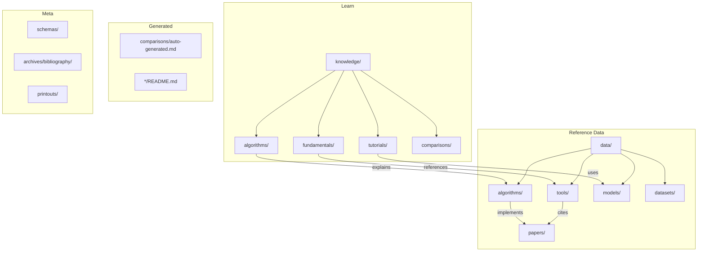

# Speaker Recognition & Diarization Knowledge Base

A comprehensive, machine-readable knowledge base for speaker diarization, speaker recognition, and voice fingerprinting technologies.

## Purpose & Scope

This repository serves as a **structured reference** for anyone working with speaker-related audio processing:

* **Practitioners** implementing speaker diarization systems
* **Researchers** exploring embedding architectures and clustering algorithms
* **Hackers** building custom voice fingerprinting solutions
* **Engineers** evaluating tools and frameworks for production use

## What's Inside

```
├── data/
│   ├── tools/           # 10 frameworks (pyannote, SpeechBrain, NeMo, ESPnet...)
│   ├── algorithms/      # 10 algorithms by category (embeddings, clustering, VAD)
│   ├── models/          # 5 pre-trained models (ECAPA, TitaNet, Sortformer...)
│   └── datasets/        # 5 benchmark corpora (VoxCeleb, AMI, CALLHOME, DIHARD)
├── papers/              # 6 research papers with metadata
├── knowledge/           # 14 educational articles
│   ├── fundamentals/    # Pipeline, metrics, embeddings, glossary
│   ├── algorithms/      # ECAPA-TDNN, clustering deep dives
│   ├── tutorials/       # Pyannote quickstart, training, voice fingerprints
│   └── comparisons/     # Framework selection, embedding architectures
├── comparisons/         # Auto-generated comparison tables
├── archives/            # Bibliography (16 BibTeX entries)
├── printouts/           # Archived web content with provenance
├── ramblings/           # Research notes and explorations
└── schemas/             # 6 YAML specifications for each entry type
```

## Knowledge Base Structure



## Quick Navigation

| You Want To... | Go To |
|----------------|-------|
| **Learn speaker diarization** | [knowledge/fundamentals/](knowledge/fundamentals/) |
| Compare diarization tools | [comparisons/auto-generated.md](comparisons/auto-generated.md) |
| Find the best framework | [data/tools/](data/tools/) |
| Understand ECAPA-TDNN | [knowledge/algorithms/ecapa-tdnn-explained.md](knowledge/algorithms/ecapa-tdnn-explained.md) |
| Get started with pyannote | [knowledge/tutorials/pyannote-quickstart.md](knowledge/tutorials/pyannote-quickstart.md) |
| Build voice fingerprint system | [knowledge/tutorials/building-voice-fingerprint-system.md](knowledge/tutorials/building-voice-fingerprint-system.md) |
| Get benchmark datasets | [data/datasets/](data/datasets/) |
| Add new content | [CONTRIBUTING.md](CONTRIBUTING.md) |
| Understand source tracking | [TRACEABILITY.md](TRACEABILITY.md) |
| Regenerate tables/docs | [REGENERATION.md](REGENERATION.md) |

## Core Concepts

### Speaker Diarization Pipeline

```
┌─────────┐    ┌──────────────┐    ┌───────────────────┐    ┌────────────┐
│  Audio  │───▶│     VAD      │───▶│    Embedding      │───▶│ Clustering │───▶ Output
└─────────┘    │  Detection   │    │    Extraction     │    │            │    (RTTM)
               └──────────────┘    └───────────────────┘    └────────────┘
                    │                      │                       │
              Speech/Silence         x-vectors           AHC / Spectral
                                   ECAPA-TDNN                 VBx
```

**Stage 1: VAD** - Detect speech vs silence regions
**Stage 2: Segmentation** - Find speaker change points
**Stage 3: Embeddings** - Extract speaker-discriminative vectors
**Stage 4: Clustering** - Group segments by speaker identity

### Key Metrics

| Metric | Full Name | Measures | Good Value |
|--------|-----------|----------|------------|
| **DER** | Diarization Error Rate | Overall accuracy | <10% |
| **EER** | Equal Error Rate | Verification accuracy | <1% |
| **RTF** | Real-Time Factor | Speed | <1.0 |

## Quick Start

```bash
make validate  # Validate all YAML files
make tables    # Regenerate comparison tables
make clone     # Clone tracked repositories to tmp/
make help      # Show all available commands
```

## Traceability Principles

This knowledge base emphasizes **source attribution and auditability**:

1. **Every fact has a source** - All data entries cite their sources
2. **Timestamps everywhere** - `last-update` field on all entries
3. **Git precision** - Code references include commit hashes
4. **Archived content** - Web sources preserved in `printouts/`
5. **Regenerable tables** - All generated content has clear rebuild path

Example source citation:

```yaml
sources:
  - url: "https://github.com/pyannote/pyannote-audio"
    accessed: "2026-01-05"
    commit: "abc123"
    source-type: primary
```

## For Different Users

### Casual Explorer

Start with [comparisons/auto-generated.md](comparisons/auto-generated.md) for quick tool overview, then browse specific entries that interest you.

### Practitioner

Read the [knowledge/](knowledge/) articles for conceptual grounding, then explore [data/tools/](data/tools/) for implementation options.

### Researcher

Check [papers/](papers/) for academic references, [data/algorithms/](data/algorithms/) for algorithm details, and original paper citations in each entry.

### Contributor

Read [CONTRIBUTING.md](CONTRIBUTING.md) for guidelines, check [schemas/](schemas/) for YAML specifications, and validate with `make validate`.

## Learning Path

```
┌─────────────────────────────────────────────────────────────────────────┐
│                           BEGINNER                                       │
│  knowledge/fundamentals/pipeline-architecture.md                         │
│  knowledge/fundamentals/speaker-embeddings.md                            │
│  knowledge/fundamentals/evaluation-metrics.md                            │
│  knowledge/fundamentals/glossary.md                                      │
└────────────────────────────────┬────────────────────────────────────────┘
                                 │
                                 ▼
┌─────────────────────────────────────────────────────────────────────────┐
│                          INTERMEDIATE                                    │
│  knowledge/algorithms/ecapa-tdnn-explained.md                            │
│  knowledge/algorithms/clustering-comparison.md                           │
│  knowledge/comparisons/embedding-architectures.md                        │
│  knowledge/comparisons/framework-selection.md                            │
└────────────────────────────────┬────────────────────────────────────────┘
                                 │
                                 ▼
┌─────────────────────────────────────────────────────────────────────────┐
│                           PRACTICAL                                      │
│  knowledge/tutorials/pyannote-quickstart.md                              │
│  knowledge/tutorials/custom-embedding-training.md                        │
│  knowledge/tutorials/building-voice-fingerprint-system.md                │
└─────────────────────────────────────────────────────────────────────────┘
```

## Repository Stats

| Category | Count | Directory |
|----------|-------|-----------|
| Tools | 10 | `data/tools/` |
| Algorithms | 10 | `data/algorithms/` |
| Models | 11 | `data/models/` |
| Datasets | 5 | `data/datasets/` |
| Papers | 15 | `papers/` |
| Knowledge Articles | 14 | `knowledge/` |
| Schemas | 6 | `schemas/` |

## Related Resources

* [pyannote.audio Documentation](https://github.com/pyannote/pyannote-audio)
* [SpeechBrain Tutorials](https://speechbrain.github.io/)
* [NVIDIA NeMo Speaker Tasks](https://docs.nvidia.com/nemo-framework/user-guide/latest/nemotoolkit/asr/speaker_diarization/intro.html)
* [VoxCeleb Dataset](https://www.robots.ox.ac.uk/~vgg/data/voxceleb/)

## Contributing

See [CONTRIBUTING.md](CONTRIBUTING.md) for guidelines on adding new entries.

Key points:

* Follow schema specifications in `schemas/`
* Include source citations with access dates
* Run `make validate` before committing
* Use dated filenames for ramblings: `YYYY-MM-DD--topic.md`

## License

This knowledge base is released under MIT License.

---

*Last updated: 2026-01-06*
